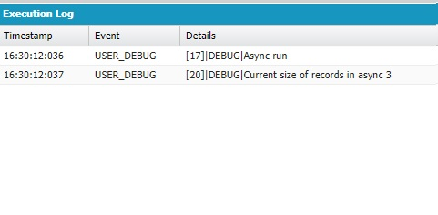

# Salesforce Trigger Pattern

This guide will help Salesforce developers understand how to create triggers with two types of execution - Synchronous and Asynchronous.
Trigger Pattern is a Unlocked Package for quick installation and deployment of trigger structures for standard and custom SObjects.
You can quickly and easily create triggers for your needs with a minimum amount of code.

## Part 1: Installation

#### Before start
Before you can get to the good stuff, let’s make sure you have everything set up that you need to start:
- You need to make sure you have a Developer Hub (Dev Hub) and the Salesforce CLI is installed. If not, [do it](https://trailhead.salesforce.com/content/learn/modules/sfdx_app_dev/sfdx_app_dev_setup_dx);
- Download the source from the [TriggerPattern repository](https://github.com/GFL-SF-Team/TriggerPattern);

#### Install the Package Version in an Org

Trigger Pattern is a released package version. You can install it in any org by package alias e.g. - "Trigger_Pattern@1.0.0-1". 
You can find current Version in [sfdx-project.json file](https://github.com/GFL-SF-Team/TriggerPattern/blob/master/sfdx-project.json)
packageAliases section.

- Open Terminal and login into your Dev Hub

```sfdx cli
sfdx force:auth:web:login -d -a YourDevHubName
```
**YourDevHubName** - your Dev Hub alias

- Install the package version

```sfdx cli
sfdx force:package:install --wait 10 --publishwait 10 --package Trigger_Pattern@1.0.0-1 -k TriggerPattern -r -u YourDevHubName
```
**-k** - installation key for key-protected package - "TriggerPattern";

**--package** - ID (starts with 04t) or alias of the package version to install;

- Open your Org

```sfdx cli
sfdx force:org:open -u YourDevHubName
```

In your Trailhead playground, from Setup, enter Installed Packages in the Quick Find box, then select Installed Packages.
You also receive an email that confirms you successfully installed the unlocked package.

Example:


![[Installed Package Screen]](./img/installedPackage.jpg)

You also receive an email that confirms you successfully installed the unlocked package.
- Click Trigger_Pattern, then View Components.

Example: 

![[Installed Package Components Screen]](./img/installedPackageComponents.jpg)


>If don't have access to Package Components, you need to assign permission set for your user:
> ```sfdx cli
> sfdx force:user:permset:assign -n For_trigger_pattern -u YourDevHubName
>```

## Part 2: Trigger Pattern Guide

#### Architecture
Our Trigger Pattern consists of:
- Set of Apex classes (Interface, Handler Implementation, Api, Data Accessor, Service and Test Handler For Test Object);
- Custom Metadata Types with test records (Trigger Handler Assignment);
- Custom Object for Coverage and Example (Test Coverage Object);
- Permission Set.

#### Workflow Visualization


> Step 1. CRUD Action with SObject Record and SObject Trigger starts
>
> Step 2. SObject Trigger calls the Pattern API
>
> Step 3. The Pattern API Determines the type of record and passes its name to the Service
>
> Step 4. The Service calls the Data Accessor
>
> Steps 5-7. The Data Accessor makes a request to the Custom Metadata Types and returns to the Service a set of records by object name 
>
> Step 8. The Service runs one synchronous execution of SObject Trigger Handler
>
> Step 9. After synchronous execution the Service runs all asynchronous execution (Queueable Jobs)

## Part 3: Example

The best explanation is practice. We will create an account trigger and show you how it works.

The First you need to create AccountTrigger and calls the Pattern API:

```salesforce.apex
trigger AccountTrigger on Account (
		before insert,
		before update,
		before delete,
		after insert,
		after update,
		after delete,
		after undelete
) {

	Util_TriggerPattern_API.executeObjectTriggerHandlers();

}
```

The Second you need to create AccountTriggerHandler and extend Util_TriggerHandlerImplementation:

```salesforce.apex
public class AccountTriggerHandler extends Util_TriggerHandlerImplementation {

}
```

The Third you need create records of Custom Metadata Type.

Example:


> **Handler Name** - it is a name of SObject Trigger Handler Apex Class, which will be execute synchronously or asynchronously.
>
> **Object API Name** - it is a SObject API name
>
> **Handler Execution** - it is a execution type. We have three types of execution: _Sync_ - Synchronous, 
> _Async After SObject Sync Update_ - asynchronous execution type that is called if records have been updated (recursion)
> and _Async After Sync Execution_ - asynchronous execution type that is called when Synchronous execution is done or empty.

> NOTE: Sync Execution can be only one for a SObject.
>
> NOTE: All Async jobs run after Sync Execution.
>
> NOTE: You can create up to 50 asynchronous executions per transaction.


The Fourth, you need to override  a specific method by adding the necessary functionality to it:

Dummy Example:

```salesforce.apex
public class AccountTriggerHandler extends Util_TriggerHandlerImplementation {


	public override void onBeforeInsertFunction() {
		System.debug('Override onBeforeInsertFunction run');
		System.debug(Trigger.new);
	}


}
```

When we create a Account record, our trigger runs onBeforeInsertFunction and we see debugging in the developer console.

Screen:


>NOTE: At each stage of the sync trigger execution, you have access to records (new, newMap, old, oldMap) 
according to the Salesforce Developer Documentation - [Trigger Context Variables](https://developer.salesforce.com/docs/atlas.en-us.apexcode.meta/apexcode/apex_triggers_context_variables.htm)

>NOTE: When Async Jobs run you can access the records through methods: getUpdatedRecordsList() or getUpdatedRecordsMap()

>NOTE: If during synchronous execution of a trigger records (Trigger.isAfter) were changed you can set it to the current handler properties
by methods: setUpdatedRecordsFromList(SObject[] records) and setUpdatedRecordsFromMap(Map<Id, SObject> records). 
>
> If You don't set new version of records for async execution, the Service sets Trigger.new list for your async jobs

>After Sync execution is done, async jobs can get current version of records call methods getUpdatedRecordsList() or getUpdatedRecordsMap()


We want to add more records to async job then we have in sync execution (it's just example - You can use it as you wish):

```salesforce.apex
public class AccountTriggerHandler extends Util_TriggerHandlerImplementation {

	public override void onAfterInsertFunction() {
		System.debug('Override onAfterInsertFunction run');
		System.debug('Trigger new size = ' + Trigger.new.size());
		Account account = (Account) Trigger.new[0];

		this.setUpdatedRecordsFromList(new SObject[]{account, account, account});

	}

	public override void execute(QueueableContext context) {
		System.debug('Async run');
		Account[] currentVersionofRecords = (Account[]) this.getUpdatedRecordsList();

		System.debug('Current size of records in async ' + currentVersionofRecords.size());

	}

}
```

Look to our debugging in the developer console:

Sync Execution - we have only one record:


then we call setUpdatedRecordsFromList and put list with three account, look what we have in async execution:



Yes we have list with three elements in QueueableContext.